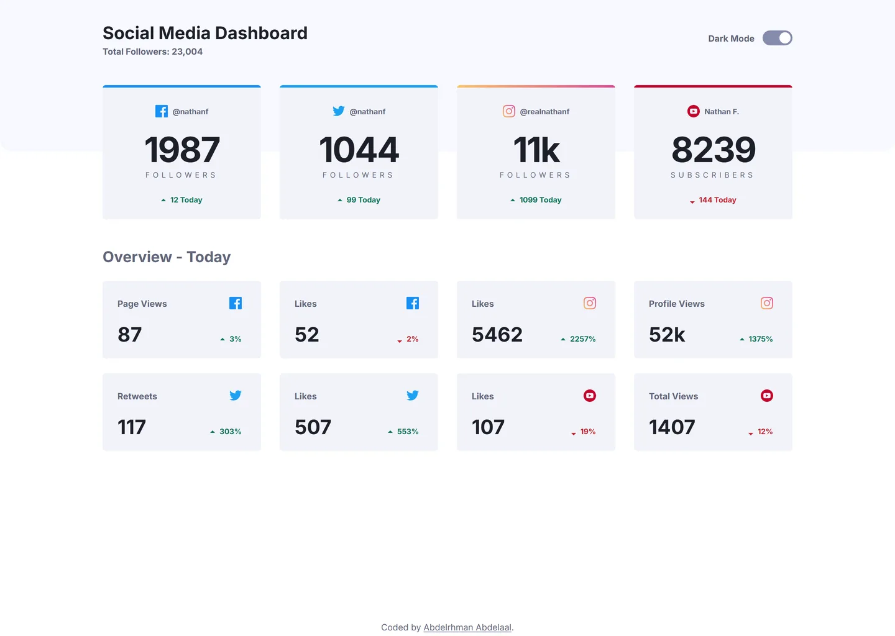

# Frontend Mentor - Social media dashboard with theme switcher solution

This is a solution to the [Social media dashboard with theme switcher challenge on Frontend Mentor](https://www.frontendmentor.io/challenges/social-media-dashboard-with-theme-switcher-6oY8ozp_H). Frontend Mentor challenges help you improve your coding skills by building realistic projects.

## Table of contents

- [Overview](#overview)
  - [Screenshot](#screenshot)
  - [Links](#links)
- [My process](#my-process)
  - [Built with](#built-with)
  - [Design deviations](#design-deviations)
- [Author](#author)

## Overview

### Screenshot

### Links

- Solution URL: [GitHub](https://github.com/MrBlackvanta/social-media-dashboard-with-theme-switcher)
- Live Site URL: [Cloudflare](https://social-media-dashboard-with-theme-switcher.abdelrhman-ahmed8881.workers.dev)

## My process

### Built with

- [Next.js 16](https://nextjs.org/) (App Router, React Compiler, Turbopack, static export)
- [React 19](https://react.dev/)
- [TypeScript](https://www.typescriptlang.org/) (strict)
- [Tailwind CSS v4](https://tailwindcss.com/)

### Design deviations

**Every colour is taken from the `.fig`, not the style guide.** The style guide's HSL values round a
point off on most of the palette: `hsl(163 72% 41%)` gives `#1DB489` against the file's `#1EB589`,
`hsl(208 92% 53%)` gives `#198FF5` against `#178FF5`, `hsl(230 17% 14%)` gives `#1E202A` against
`#1D1F29`, and `hsl(225 100% 98%)` gives `#F5F7FF` against `#F7F9FF`. Two colours the style guide
omits entirely: the light theme's `Dark Mode` label and mobile divider (`#848BAB`), and the hover
surface each theme lightens its cards to.

**The green and red deltas move for WCAG AA, in opposite directions per theme.** At 12px bold they
are small text and need 4.5:1, and the design's `#1EB589` measures only 2.36 on the light card.
Hue and saturation are held exactly in every case below; only lightness moves, and each value clears
4.5:1 on the hovered surface too, not just the resting one.

|                   | design    | resting | hover | shipped   | resting | hover |
| ----------------- | --------- | ------- | ----- | --------- | ------- | ----- |
| Delta up, light   | `#1EB589` | 2.36    | 2.06  | `#137458` | 5.17    | 4.52  |
| Delta down, light | `#DC414C` | 3.86    | 3.38  | `#C52430` | 5.16    | 4.51  |
| Delta up, dark    | `#1EB589` | 5.34    | 4.28  | `#1FBA8C` | 5.63    | 4.51  |
| Delta down, dark  | `#DC414C` | 3.26    | 2.61  | `#E98A90` | 5.66    | 4.53  |
| Muted ink, light  | `#63687D` | 4.98    | 4.35  | `#61657A` | 5.19    | 4.54  |
| Muted ink, dark   | `#8C98C6` | 4.94    | 3.95  | `#99A3CC` | 5.63    | 4.51  |

**The `Dark Mode` label uses the mobile frame's colour at both breakpoints.** The design contradicts
itself: the desktop frames paint it `#848BAB` (3.19 on the top band — a fail at 14px bold), the
mobile frames paint it `#63687D`, which is the same muted ink as every other label on the page. The
mobile branch is both accessible and consistent, so it wins.

**The light theme's toggle track darkens to `#848BAB` and its knob to `#FFFFFF`.** As designed, the
track measures 1.97 against the top band and the knob 1.87 against the track, so neither the
control's boundary nor its state clears the 3:1 that WCAG 1.4.11 asks of a UI component — and axe
has no 1.4.11 rule, so nothing would have caught it. The replacements are 3.19 and 3.22, and both
are colours the file already uses elsewhere (`#848BAB` is the mobile divider). The dark theme's
toggle passes as drawn (4.16).

**Line height is `normal`, not a token per size.** Every text node in the `.fig` leaves `lineHeight`
on AUTO, so the design's line boxes are Inter's own 1.21 rather than Tailwind's 1.5 default. One
declaration on `body` reproduces all five measured box heights exactly (34 / 17 / 48 / 15 / 39 for
28 / 14 / 56 / 12 / 32px), so the `--text-*` tokens deliberately ship without paired line heights
and inherit it. The 56px count is the one exception the file states outright, at 48px.

**Gradients interpolate in sRGB and the 4px bars run horizontally.** Tailwind defaults gradients to
oklab, which puts the Instagram bar's midpoint 7/255 off in green, so every gradient carries the
`/srgb` modifier — Figma interpolates in sRGB, and its own third stop at 51% is exactly the sRGB
midpoint. The bar's direction cannot be read from the paint transform either: Figma stores it in
normalized space, so one matrix covers both the 20×20 icon (a true top-right → bottom-left diagonal)
and the 255×4 bar, where a CSS corner keyword would rotate the axis to near-vertical. Sampling the
design's own export shows the bar's top and bottom rows are identical, i.e. a full-range horizontal
sweep, which is what ships.

**There is no tablet frame,** so everything between 376px and 1439px is designed rather than derived.

## Author

- UpWork - [Abdelrhman Abdelaal](https://www.upwork.com/freelancers/mrblackvanta)
- Frontend Mentor - [@MrBlackvanta](https://www.frontendmentor.io/profile/MrBlackvanta)
- LinkedIn - [Abdelrhman Abdelaal](https://www.linkedin.com/in/abdelrhman-vanta/)
